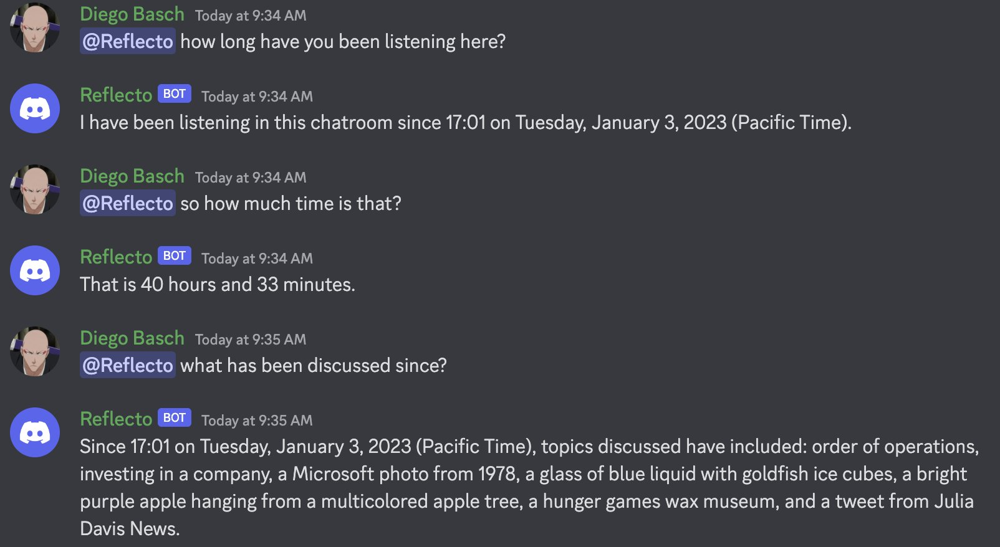

# Reflecto - a GPT3 bot for discord

Reflecto is a simple Discord bot that you can chat with. It has a memory queue, so it will remember a few dozen messages in the scrollback buffer. You can ask it to summarize what it remembers, for example:

## Requirements:

* a server with python 3 installed.
* an OpenAI account with access to GPT-3
* administrative access to a discord guild

## How to run it:

* Check out this repo, create a .env file with your tokens:
		    
		  # .env
			DISCORD_TOKEN=[your discord token]
			DISCORD_GUILD=[your guild id]
			OPENAI_API_KEY=[your OpenAI api key]

* run pip install -r requirements.txt
* add your bot to your guild following the steps outlined [here](https://realpython.com/how-to-make-a-discord-bot-python/). It needs permissions to read and write messages, not much else.
* Run the bot: nohup python bot.py >logfile.txt

The bot will only respond when @ mentioned with whatever name you chose for it.
